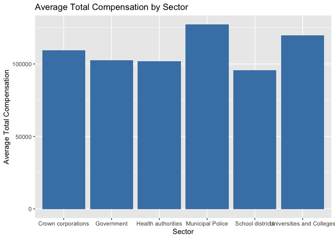
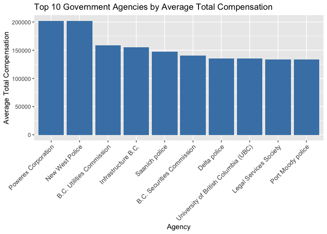
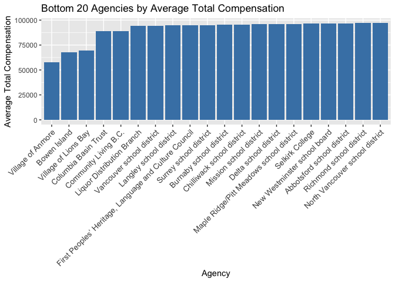

BC Sunshine List Data Analytics Project
================
Edward Aguilar
2023-05-30

## How much do public servants in British Columbia make?

#### A BC Sunshine List FY 2020-2021 Data Analysis using R

The data sets for my data analysis project were collected from the
Vancouver Sun, which has collected and compiled the names and salaries
of approximately 120,000 workers at public sector agencies across
British Columbia. The source of the data can be found
[here](https://github.com/vs-postmedia/public-sector-salary-data/tree/main/data/public_sector_salary-fy20_21).

I will outline the step-by-step process I followed to prepare and clean
the data sets for analysis. **If you are interested in the results and
analysis, you can skip to Parts 4 and 5 directly.** In those sections, I
conducted the descriptive analysis and created data visualizations to
present the findings.

We begin by loading the required packages:

``` r
library(tidyverse)  #helps wrangle data
library(ggplot2)  #helps visualize data
getwd() #displays your working directory
setwd("/Users/edjohna/Desktop/Data Analytics/CASE STUDIES/BC Sunshine List Dataset") #sets your working directory to simplify calls to data
```

### 1. Collect data

I uploaded the the data sets (csv files) using `read_csv()`.

``` r
crown <- read_csv("public_sector_salary-fy20_21-crown.csv")
govt <- read_csv("public_sector_salary-fy20_21-government.csv")
health <- read_csv("public_sector_salary-fy20_21-health.csv")
police <- read_csv("public_sector_salary-fy20_21-police.csv")
schools <- read_csv("public_sector_salary-fy20_21-schools.csv")
universities <- read_csv("public_sector_salary-fy20_21-universities.csv")
```

### 2. Wrangle data and combine into a single file

In this step, I compared the column names of each of the files. While
the names do not have to be in the same order, they do need to match
perfectly before we can use a command to join them into one file.

``` r
colnames(crown)
colnames(govt)
colnames(health)
colnames(police)
colnames(schools)
colnames(universities)
```

Next, I inspected the data frames to look for incongruities.

``` r
str(crown)
str(govt)
str(health)
str(police)
str(schools)
str(universities)
```

I noticed some of the columns did not have the same data type. I then
converted the data types of those columns so that they can stack
correctly.

``` r
govt <-  mutate(govt, Expenses = as.double(Expenses)
                   ,Year = as.character(Year)) 

police <-  mutate(police, Year = as.character(Year))
```

After converting, I stacked the data sets into one big data frame.

``` r
salary <- bind_rows(crown,govt,health,police,schools,universities)
```

Since this data set is for FY 2020-2021, and the different agencies had
different ways of typing out the fiscal year, I decided to standardize
the Year column to just show “2020-2021”

``` r
salary$Year <- "2020-2021"
```

### 3. Clean up and add data to prepare for analysis

In this step, I inspect the new table that has been created.

``` r
colnames(salary)  #List of column names
nrow(salary)  #How many rows are in the data frame
dim(salary)  #How many rows and columns are in the data frame
head(salary)  #See the first 6 rows of data frame
str(salary)  #See list of columns and data types (numeric, character, etc)
summary(salary)  #Statistical summary of data
```

#### Remove “bad” data

I checked the newly created table for duplicates.

``` r
duplicates <- salary[duplicated(salary) | duplicated(salary, fromLast = TRUE), ]
```

I noticed there are 506 rows of duplicated data from my data frame. I
omitted them from my data.

``` r
salary <- distinct(salary)
```

I then replaced the NAs in the Remuneration and Expenses columns to
zero. Both columns should only display numbers.

``` r
salary <- salary %>% 
  mutate_at(c('Remuneration','Expenses'), ~replace_na(.,0))
```

I checked to see if the NAs are still in the Remuneration and Expenses
columns.

``` r
sum(is.na(salary$Remuneration))
sum(is.na(salary$Expenses))
```

Some of the cells displayed as scientific notations. I can effectively
remove these by printing this code:

``` r
options(scipen=999)
```

I noticed that a director that works for the City of Victoria had an
expense of over 102 billion dollars. Knowing that this amount is clearly
incorrect, I decided to obtain the average expenses of employees working
in the same agency and in a similar role as the employee with the
incorrect value.

``` r
salary_of_vic <- salary[salary$Agency == "City of Victoria" & grepl("Director", salary$Position) & !grepl("Assistant Director|Acting Assistant Director|Deputy Director", salary$Position), ]
```

Get the mean expenses of the directors (not including the one with the
incorrect expense).

``` r
mean(tail(salary_of_vic$Expenses, 2))
```

Replace the salary data frame with the average expense.

``` r
which(salary$Expenses == 102000000000) #shows which row the incorrect expense is in
salary$Expenses[37863] <- 3104 #replaces that row with the corrected value which is 3104
```

I noticed that one employee had an expense of \$-376070. Just like the
director, I decided to replace the expense of this employee with the
average expenses of employees working in the same agency and in a
similar role as the employee with the incorrect value.

``` r
salary_of_langara <- salary[salary$Agency == "Langara College" & grepl("Manager", salary$Position),]
mean(salary_of_langara$Expenses[-9])
which(salary$Expenses == -376070)
salary$Expenses[107927] <- 1638
```

I sorted the Expenses and Remuneration columns in ascending order. I
noticed that there are employees in the data set whose names are listed
as “Employee Name” and their salaries are zero. I decided to omit these
rows.

``` r
salary <- salary[salary$Name != "Employee Name", ]
```

Lastly, I noticed employee Stephen Andrew also has his Remuneration and
Expenses set to zero. I decided to get the average Remuneration and
Expenses for people working in the same agency and position as he does
and replace it with that.

``` r
salary_of_vic2 <- salary[salary$Agency == "City of Victoria" & grepl("Councillor", salary$Position), ]
mean(salary_of_vic2$Remuneration[-2])
mean(salary_of_vic2$Expenses[-2])
which(salary$Name == "Andrew, Stephen")
salary$Remuneration[37594] <- 48038
salary$Expenses[37594] <- 854
```

I have added a new column called ‘Total’ that calculates the sum of the
‘Remuneration’ and ‘Expenses’ columns.

``` r
salary$Total <- salary$Remuneration + salary$Expenses
```

I check if there are NAs in both the Name and Total columns. These
should be omitted.

``` r
sum(is.na(salary$Name))
sum(is.na(salary$Total))
salary_na_name <- salary[is.na(salary$Name), ]
salary <- subset(salary, !is.na(Name))
```

I checked to confirm that there are no more missing values (NAs) in the
Name column.

``` r
sum(is.na(salary$Name))
```

### 4. Conduct descriptive analysis

Now that my data is clean, I can now begin conducting descriptive
analysis.

``` r
mean(salary$Total) #average salary in each public sector company in BC
median(salary$Total) #midpoint salary
max(salary$Total) #highest salary
min(salary$Total) #lowest salary
```

I can also condense the four lines above to one line using `summary()`
on the specific attribute.

``` r
summary(salary$Total)
```

#### Average total compensation (remuneration and expenses) by sector

``` r
avg_by_sector <- aggregate((Total) ~ Sector, data = salary, FUN = mean)
print(avg_by_sector)
```

    ##                      Sector   (Total)
    ## 1        Crown corporations 109607.62
    ## 2                Government 102419.69
    ## 3        Health authorities 101837.60
    ## 4          Municipal Police 127171.03
    ## 5          School districts  95810.01
    ## 6 Universities and Colleges 119647.23

Here we can observe that, on average, employees in school districts
receive the lowest compensation, while police personnel receive the
highest.

Next, we want to check how many agencies are in our data.

``` r
length(unique(salary$Agency))
```

    ## [1] 113

#### Average total compensation (remuneration and expenses) by agency

``` r
avg_by_agency <- aggregate((Total) ~ Agency, data = salary, FUN = mean)
head(avg_by_agency[order(avg_by_agency$`(Total)`, decreasing = TRUE), ], 13)
```

    ##                                   Agency  (Total)
    ## 83                   Powerex Corporation 202187.2
    ## 76                       New West Police 201638.3
    ## 15             B.C. Utilities Commission 158998.9
    ## 62                   Infrastructure B.C. 155314.2
    ## 91                        Saanich police 147345.6
    ## 14            B.C. Securities Commission 140904.8
    ## 46                          Delta police 135182.0
    ## 99  University of British Columbia (UBC) 135154.0
    ## 71                Legal Services Society 133871.7
    ## 82                     Port Moody police 133646.0
    ## 58        Forestry Innovation Investment 129308.7
    ## 98 Transportation Investment Corporation 127443.5
    ## 8                             B.C. Hydro 127023.2

Employees working for Powerex Corporation, a subsidiary of BC Hydro,
receive the highest average total compensation. New West Police
employees rank second, with a very close margin. Interestingly, BC Hydro
itself is ranked 13th on the list.

#### Top 5 Agencies with Highest CEO Compensation

Next, I created a table indexing the CEO salaries of each agency.

``` r
salary_of_ceo <- subset(salary, grepl("President|CEO|Chief Executive Officer", Position) & !grepl("Vice President|Executive Assistant|Vice-President|Vice0President|Admin Asst|Executive Director|CUPE|Cupe", Position))
head(salary_of_ceo[order(salary_of_ceo$Total, decreasing = TRUE), ], 10)
```

    ## # A tibble: 10 × 8
    ##    Agency               Name  Position Remuneration Expenses Year  Sector  Total
    ##    <chr>                <chr> <chr>           <dbl>    <dbl> <chr> <chr>   <dbl>
    ##  1 University of Briti… Jia,… Preside…       921413        0 2020… Unive… 921413
    ##  2 University of Briti… Ono,… Preside…       605074    31176 2020… Unive… 636250
    ##  3 Provincial Health S… Mori… Preside…       558990        0 2020… Healt… 558990
    ##  4 B.C. Ferries         Coll… Preside…       541923        0 2020… Crown… 541923
    ##  5 TransLink            Desm… CEO            474161     7008 2020… Crown… 481169
    ##  6 Interior Health      Brow… Preside…       449867    29612 2020… Healt… 479479
    ##  7 B.C. Hydro           O'Ri… Preside…       447565    31081 2020… Crown… 478646
    ##  8 B.C. Securities Com… Leon… Chair a…       468509     9560 2020… Crown… 478069
    ##  9 B.C. Pension Corp.   Nash… Chief E…       440545     2392 2020… Crown… 442937
    ## 10 ICBC                 Jime… Preside…       403095    18557 2020… Crown… 421652

Based on the data, it is notable that the CEOs of UBC, PHSA, BC Ferries,
Translink, and Interior Health rank among the top five agencies in terms
of CEO compensation.

#### Agencies with Lowest Total Compensation: Bottom 20

``` r
sorted_agency_ascending <- avg_by_agency[order(avg_by_agency$`(Total)`), ]
head(sorted_agency_ascending, 20)
```

    ##                                                    Agency  (Total)
    ## 110                                     Village of Anmore 57441.40
    ## 17                                           Bowen Island 67720.00
    ## 111                                  Village of Lions Bay 69592.50
    ## 42                                   Columbia Basin Trust 89059.15
    ## 44                                  Community Living B.C. 89059.15
    ## 72                             Liquor Distribution Branch 94272.19
    ## 108                             Vancouver school district 94539.69
    ## 69                                Langley school district 94709.68
    ## 56  First Peoples’ Heritage, Language and Culture Council 94933.80
    ## 94                                 Surrey school district 95043.98
    ## 18                                Burnaby school district 95370.86
    ## 21                             Chilliwack school district 95629.09
    ## 75                                Mission school district 95868.88
    ## 47                                  Delta school district 96165.87
    ## 73               Maple Ridge/Pitt Meadows school district 96189.37
    ## 92                                        Selkirk College 96331.13
    ## 77                           New Westminster school board 96591.13
    ## 2                              Abbotsford school district 96645.85
    ## 88                               Richmond school district 97004.32
    ## 79                        North Vancouver school district 97102.14

It is observed that school districts across BC dominate the list of
agencies with the least paid employees. Additionally, an agency that
works with First Nations communities in BC is also included in the
bottom 20.

### 5. Create Data Visualizations

``` r
ggplot(avg_by_sector, aes(x = Sector, y = `(Total)`)) +
  geom_bar(stat = "identity", fill = "steelblue") +
  labs(x = "Sector", y = "Average Total Compensation", title = "Average Total Compensation by Sector")
```

<!-- -->

``` r
top_10_agencies <- head(avg_by_agency[order(-avg_by_agency$`(Total)`), ], 10)

ggplot(top_10_agencies, aes(x = reorder(Agency, -`(Total)`), y = `(Total)`)) +
  geom_bar(stat = "identity", fill = "steelblue") +
  labs(x = "Agency", y = "Average Total Compensation", title = "Top 10 Government Agencies by Average Total Compensation") + theme(axis.text.x = element_text(size = 10, angle = 45, hjust = 1))
```

<!-- -->

It is evident that police agencies dominate the graph, indicating that
they have a significant presence among the agencies with the highest
total compensation.

``` r
ggplot(sorted_agency_ascending[1:20,], aes(x = reorder(Agency, `(Total)`), y = `(Total)`)) +
  geom_bar(stat = "identity", fill = "steelblue") +
  labs(x = "Agency", y = "Average Total Compensation", title = "Bottom 20 Agencies by Average Total Compensation") +
  theme(axis.text.x = element_text(size = 10, angle = 45, hjust = 1))
```

<!-- -->

Here we can observe that school districts receive the least compensation
compared to other agencies. This suggests that employees in school
districts have lower average total compensation compared to employees in
other agencies.

### 7. Export summary file for further analysis

Finally, I have created a CSV file that can be easily visualized in
Excel or Tableau. This file contains the cleaned and prepared data,
ready for further analysis and visualization.

``` r
write.csv(salary, file = '~/Desktop/salary_bc.csv')
```
